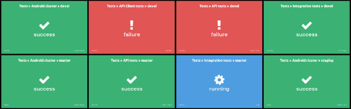

# dashbi-widget-jenkins-build-status

Dashbi widget that displays the Jenkins build status.
Created to work with `dashbi-data-provider-jenkins-build`.



## Usage

Widgets takes always the newest record from source and displays the status (build result).
In bottom-left corner last build ID is presented, and in bottom-right corner duration in HMS from

### Install

```sh
npm install --save dashbi-widget-jenkins-build-status
```

### Register

Dashbi should detect and auto-register widget.

### Example

Let's say that your Jenkins Job URL is `https://myjenkins.example.org/job/Hello/`.
Your widget configuration could look like this:

```js
dashbiLayout.addWidget({
  name: 'jenkins-build-status',
  title: 'My Jenkins Job',
  source: {
    name: 'jenkins-build',
    params: {
      jenkinsUrl: 'https://myjenkins.example.org',
      jobPath: 'job/Hello'
    }
  }
});
```

### Data Providers

Data provider used in above example is [jenkins-build](https://github.com/marverix/dashbi-data-provider-jenkins-build)
